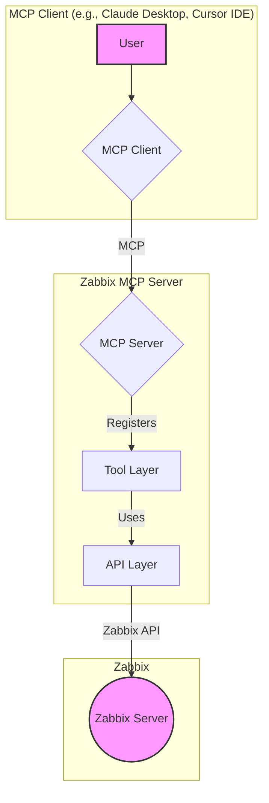

# System Architecture

The Zabbix MCP Server is a Node.js application that acts as a bridge between the Model Context Protocol (MCP) and the Zabbix API. It allows MCP-compatible clients to interact with Zabbix in a simple and consistent way.

## High-Level Architecture

The application is divided into two main layers: the **API Layer** and the **Tool Layer**.

### API Layer

The API layer, located in `src/api`, is responsible for all communication with the Zabbix API. It is designed to be a reusable and consistent interface to the Zabbix API.

**Key Components:**

*   **`zabbix-client.js`**: This is the core of the API layer. It is a singleton class that manages the connection to the Zabbix API. It handles both API token and username/password authentication, as well as connection retries and error handling.
*   **API Modules**: Each file in the `src/api` directory (e.g., `hosts.js`, `items.js`) corresponds to a specific Zabbix API module. These modules use the `zabbix-client.js` to make API calls and return the results.

**Design Principles:**

*   **Singleton Pattern**: The `zabbix-client.js` is implemented as a singleton to ensure that there is only one connection to the Zabbix API at a time.
*   **Separation of Concerns**: The `zabbix-client.js` is responsible for managing the connection, while the API modules are responsible for making API calls.
*   **Error Handling**: The API layer includes robust error handling, including a retry mechanism for authentication errors.

### Tool Layer

The tool layer, located in `src/tools`, is responsible for exposing the functionality of the API layer as MCP tools. These tools can be used by any MCP-compatible client.

**Key Components:**

*   **Tool Modules**: Each file in the `src/tools` directory (e.g., `hosts.js`, `items.js`) defines a set of related MCP tools. These tools use the API layer to interact with the Zabbix API.
*   **Schema Validation**: The tools use `Zod` to define schemas for their input parameters. This ensures that the tools are called with the correct arguments and provides clear error messages to the user.
*   **Tool Registration**: The `registerTools` function in each tool module is responsible for registering the tools with the MCP server.

**Design Principles:**

*   **Modularity**: The tools are organized into modules based on their functionality.
*   **Consistency**: The tools follow a consistent pattern, which makes it easy to add new tools.
*   **User-Friendliness**: The tools are designed to be easy to use and provide clear and informative output.

## Data Flow

1.  An MCP client sends a request to the Zabbix MCP Server.
2.  The MCP server finds the corresponding tool in the tool layer.
3.  The tool validates the input parameters using its `Zod` schema.
4.  The tool calls the appropriate function in the API layer.
5.  The API layer sends a request to the Zabbix API.
6.  The Zabbix API returns a response to the API layer.
7.  The API layer returns the response to the tool layer.
8.  The tool formats the response and returns it to the MCP client.

## Future Improvements

Based on the code review, the following improvements could be made to the architecture:

*   **Configuration**: The `connectionRetryDelay` in `zabbix-client.js` is hardcoded. This should be made configurable.
*   **Dynamic Method Calling**: The `request` method in `zabbix-client.js` uses dynamic method calling. This could be replaced with a more explicit mapping of API methods to functions.
*   **Schema Reusability**: The `interfaceSchema`, `tagSchema`, and `inventorySchema` in `tools/hosts.js` should be moved to the `src/tools/schemas` directory to improve reusability.
*   **Performance**: The `resolveHostIdentifiers` function in `tools/hosts.js` makes multiple sequential API calls. This could be improved by batching the API calls.
*   **Error Handling**: The error handling in the tools could be improved by providing more specific and user-friendly error messages.
*   **Output Formatting**: The output of the tools could be formatted in a more human-readable way.
